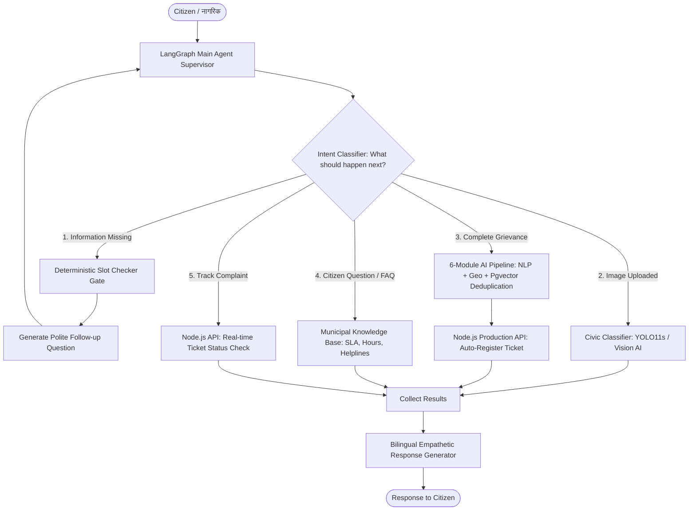

# 🏛️ WardMitra: AI Conversational Orchestrator


[](https://fastapi.tiangolo.com)
[](https://www.python.org/)
[](https://openai.com/)
[](https://aws.amazon.com/dynamodb/)
[](https://github.com/pgvector/pgvector)

---

## 📖 1. Project Overview

**WardMitra AI Orchestrator** is an enterprise-grade municipal conversational AI platform designed to replace tedious, rigid civic complaint forms with human-like, empathetic dialogue in **Marathi (देवनागरी), Hindi (हिंदी), and English**.

Instead of a basic scripted chatbot, WardMitra features an **Agentic Supervisor Architecture** that reasons about incoming messages, extracts missing civic details dynamically, classifies civic issues from attached photos (YOLO/Vision AI), checks for duplicate complaints within a 500-meter radius using vector embeddings, answers municipal FAQs, and tracks existing complaints in real-time.

---

## 🏗️ 2. Architectural Flow

The orchestrator operates via a **5-Branch Main Agent Routing Architecture**:



---

## ✨ 3. Key Implemented Features

### 🧠 A. Main Conversational Agent (`app/core/main_agent.py`)
- Coordinates the 5 functional branches seamlessly without rigid hardcoded flows.
- Handles conversational context-switching (e.g., answering office timings in the middle of reporting a pothole, then immediately returning to collect the location).
- Formulates warm, respectful municipal responses in the citizen's native language.

### 🧭 B. Intelligent Intent Classifier (`app/core/agent_router.py`)
- Analyzes user inputs using fast-path heuristic evaluation combined with zero-shot LLM reasoning.
- Categorizes intents into:
  1. `question` — Citizen inquiring about municipal services, timings, fees, or SLAs.
  2. `track_complaint` — Checking status of previous tickets (extracts IDs like `#123` or `CMP-1001`).
  3. `image_provided` — Media attachment detected; runs vision classification.
  4. `complaint` — Fully specified civic issue ready for verification and submission.
  5. `information_missing` — Civic issue reported but missing landmark/location.
  6. `chitchat` — Greetings, pleasantries, and gratitude.

### 💾 C. Unified Dynamic State Manager (`app/state/state_manager.py`)
- Provides a unified, resilient session storage layer across:
  - **AWS DynamoDB:** Serverless cloud session persistence with 24-hour TTL (Asia Pacific Mumbai `ap-south-1`).
  - **Redis:** In-memory cluster cache fallback with TTL support.
  - **In-Memory Store:** Zero-dependency local development fallback.
- **Auto-Detection & Fallback:** Automatically resolves the best available backend. If network or cloud access drops, the system falls back gracefully to in-memory mode without crashing.
- Preserves 100% backwards compatibility for legacy modules.

### 📚 D. Municipal Knowledge Base & RAG Tool (`app/tools/rag_knowledge.py`)
- Built-in authoritative knowledge base for Kalyan-Dombivli Municipal Corporation:
  - **Office Working Hours & Visiting Timings** (10:00 AM – 5:45 PM; 2nd/4th Saturday holidays).
  - **Emergency Helplines** (Disaster Cell, Fire, Police, Ambulance, Electricity, Water).
  - **Citizen Charter SLAs** (Garbage: 24h, Streetlights: 24-48h, Potholes: 48-72h, Water leaks: 12-24h).
  - **Civic Services** (Property tax portal guidelines, birth/death certificate procedures).

### 🔍 E. Semantic Deduplication with Pgvector (`app/pipeline/duplicate_detector.py`)
- Combines **OpenAI text-embedding-3-small (1536 dimensions)** and **PostgreSQL `pgvector`** cosine distance (`<=>`).
- Formula: `(Location Proximity 40%) + (Category Match 30%) + (Semantic Vector 30%)`.
- Auto-merges duplicate reports within a 500-meter radius to prevent duplicate work orders.

### 🛡️ F. Multimodal Safety & Vision Classification
- **Content Moderation (`app/pipeline/content_moderator.py`):** HuggingFace NSFW filter blocks inappropriate uploads.
- **Civic Classification (`app/pipeline/civic_classifier.py`):** Fine-tuned YOLO11s and multimodal vision categorizes civic issues (Garbage, Potholes, Water Leakage, Streetlight).
- **Profanity Checker (`app/pipeline/profanity_checker.py`):** Filters abusive terms in Marathi, Hindi, and English.

---

## 🚀 4. How to Run the Project (Step-by-Step)

### Step 1: Clone the Repository
```bash
git clone https://github.com/Siddhesh1235/wardmitra-conversational.git
cd wardmitra-conversational/orchestrator
```

### Step 2: Create and Activate Virtual Environment
```powershell
# On Windows PowerShell:
python -m venv venv
.\venv\Scripts\Activate.ps1
```

*(On Linux / macOS: `source venv/bin/activate`)*

### Step 3: Install Dependencies
```bash
pip install -r requirements.txt
pip install pgvector boto3 python-dotenv
```

### Step 4: Start the Orchestrator Server
```bash
uvicorn main:app --reload --port 8000
```

Once started, the server will output:
```text
INFO:     Uvicorn running on http://127.0.0.1:8000 (Press CTRL+C to quit)
INFO:     Connected to AWS DynamoDB table 'wardmitra_sessions' in region 'ap-south-1' (TTL: 86400s)
INFO:     Conversational LLM Client (GPT-4o-mini) initialized successfully.
INFO:     Application startup complete.
```

---

## 🌐 5. API Documentation & Interactive Testing

Open your browser and navigate to:
👉 **[http://127.0.0.1:8000/docs](http://127.0.0.1:8000/docs)**

This opens the interactive **FastAPI Swagger OpenAPI UI**.

### Main Endpoints Available:

| HTTP Method | Endpoint | Description |
| :--- | :--- | :--- |
| `GET` | `/health` | Live health check verifying all AI engines and database status. |
| `POST` | `/api/conversation/chat` | **Main Conversational Endpoint:** Multi-turn dialogue, missing slot collection, FAQ answering, image processing, and complaint registration. |
| `POST` | `/api/inference/process` | Direct 6-module AI pipeline execution (NSFW + YOLO + NLP + Geo + Deduplication + Scoring). |
| `POST` | `/api/inference/classify-civic` | Standalone civic image classification using YOLO11s / Vision AI. |
| `POST` | `/api/inference/moderate-media` | Media safety and NSFW filter check. |
| `POST` | `/api/inference/nlp` | Multilingual NLP text analysis (urgency, category, summary). |

